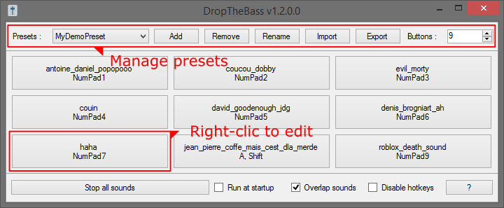
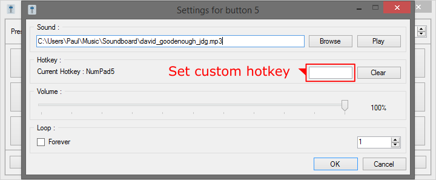

# DropTheBass

## About
A simple (yet powerful) soundboard for Windows. Be ready to D-D-D-D-DROP THE BASS!

## Features

- Supports almost any file type (mp3, mp4, wav, flac, ogg, avi, mkv, ...)
- Also supports playback of video files (just sound, of course)
- 250+ meme sounds included (see `sounds` directory)
- Manage multiple configuration profiles (presets)
- Import / export of presets from / to XML file
- Activate / deactivate hotkeys with a click
- Set custom hotkeys for each sound
- Adjust volume for each sound
- Fully portable, no rights / setup needed
- No administrator rights needed
- Free, copyleft license

## Requirements
- Microsoft [.NET Framework 4](https://www.microsoft.com/en-US/download/details.aspx?id=17851)
- Microsoft Windows Vista or later

## Todo
- Localization
- Add drag & drop between buttons
- Set custom name / color for buttons
- Add better sizing for MainForm
- Fix bug for hotkeys combo
- Create setup / installer
- Better README for git

## Libraries
- FFplay from [FFmpeg Tools](https://www.ffmpeg.org/)
- Level Slider emoji :level_slider: from [Twemoji](https://github.com/twitter/twemoji)

## License
DropTheBass is released under the [GNU General Public License v3.0](https://www.gnu.org/licenses/gpl-3.0.fr.html).
